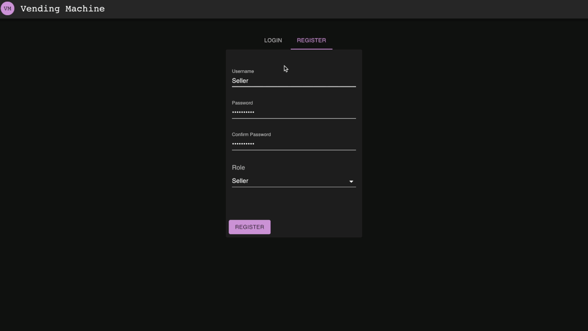
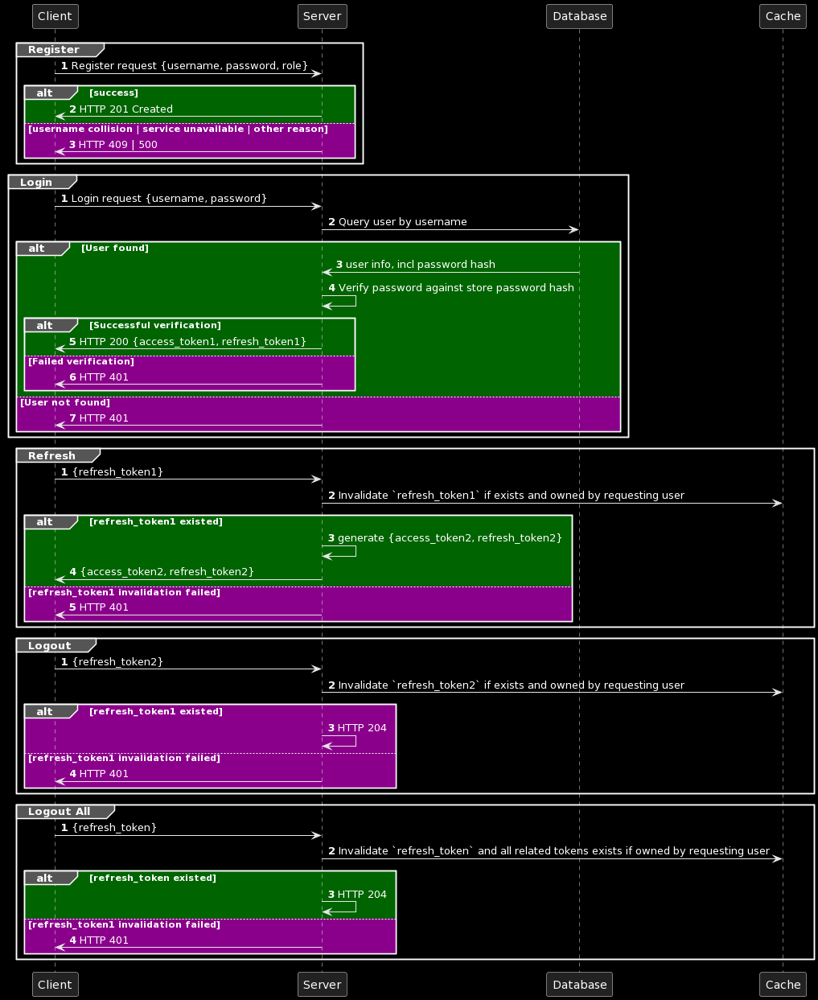

# Vending Machine

A full-stack "vending machine" sample web application,
that allows users with a `seller` role to add, update or remove products,
while users with a `buyer` role can deposit
coins into the machine and make purchases.

The vending machine accepts only 5, 10, 20, 50 and 100 cent coins

## Demo

<details >
  <summary>Seller Flow</summary>



</details>
<details open>
  <summary>Buyer Flow</summary>


</details>

## Architecture


### Frontend

The frontend consists of an SPA web app, built with

- React.js
- MaterialUI
- RTK toolkit

### Backend

The backend is implemented using SpringBoot and the following components:

- Spring-boot-data JPA & Postgres for persistence
- Spring-boot-redis & Redis for caching
- Spring-boot-web, including validation for rest APIs
- Spring-web-security & auth0-jwt library for authentication and authorization

### Security

The application security is implemented using spring-web-security library and consists of the follwing flows:
- register flow: store user info, like username and password hash in the `user` table
- login flow: validate username/password combination, and, if successful, generate a short-lived JWT `access_token` and a long_lived `refresh_token`
  - store a unique identifier of the `refresh_token` in a cache, associated with the user identity
  - include a counter of the active-stored `refresh_tokens` for the user, indicating other active sessions
- refresh flow: generate another pair of {`access_token`, `refresh_token`} based on the submitted `refresh_token`
  - validate that the submitted `refresh_token` belongs to the user requesting a token refresh
  - if the validation succeeds, store the new `refresh_token` and invalidate the old one
  - return the generated  {`access_token`, `refresh_token`} pair
- logout flow: prevent further token refresh actions by invalidating the provided refresh token
  - event though the current `access_token` is removed from browser storage, theoretically it's still usable until expiration
- logout-all flow: prevent further token refresh actions by invalidating all refresh tokens associated with a user id 
  - client includes a `refresh_token` in the request and all `request_tokens` beloging to the same tokens family will be invalidated

<details open>
  <summary>Security Diagram</summary>



</details>

## Running 
### Prerequisites
- docker environment
- jdk >= 17

### Backing services 
The easiest way to start the backing services (database, cache) by running the docker containers from `backend/dev/vending-machine-dev-containers/docker-compose.yaml`
```shell
cd dev/dev-backing-services
docker-compose up -d 
```

### Backend App
The backend can be started 
- In an IDE, by running the main class `VendingMachineApplication` 
- In CLI mode, by running the spring boot plugin `mvn spring-boot:run` target
```shell
cd backend
./mvnw spring-boot:run
```
### Frontend App
The frontend app can be started in dev-mode `npm run start` command
```shell
cd frontend
npm run start
```

### Cypress end-to-end tests

The end-to-end tests can be run against local environment, once:
- the initial setup is done
```shell
npm run cypress:install
```
- [Backing services](#backing-services), [Backend](#backend-app) and [Frontend](#frontend-app) are up and running

#### In visual mode (Chrome or Electron browser)
```shell
cd frontend-e2e
npm run cypress:open
```
#### Headless mode
```shell
cd frontend-e2e
npm run cypress:run
```

## Testing

The application correctness is covered by the following categories of tests:

- Unit & functional tests w/ JUnit5
- API integration tests w/ spring-boot-test (w/ web environment) & test-containers (postgres & redis)
- End-to-end frontend tests with cypress